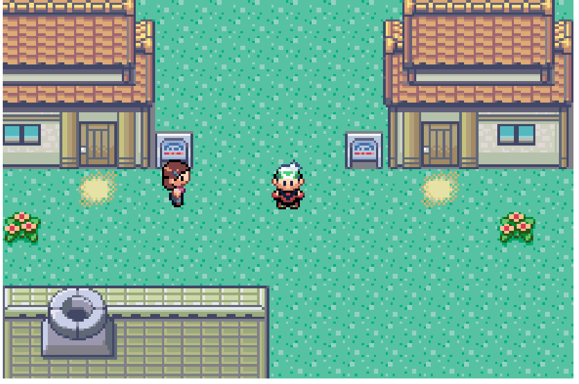

# Pokemon-Emerald-js
Pokemon Emerald Built In Javascript Canvas

## Running the game
1. clone the repository
2. move to the repository directory with cmd - `cd path_to_pokemon_emerald_base_dir`
3. start the app - `npm start`
